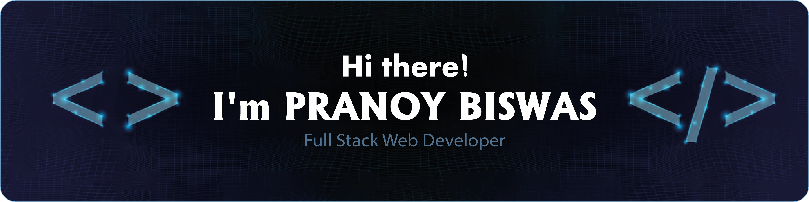

<!-- GitHub Profile README for Pranoy Biswas -->

<!-- Cover Photo -->

  

  

---

### 👨‍💻 About Me

- 🔭 I'm a **Full Stack Web Developer (MERN)** who builds scalable, modern web applications.
- 🌱 Constantly exploring new tools, technologies, and better ways to solve problems.
- 💼 I enjoy collaborating on open-source and client projects that make a difference.
- 📫 Reach me at: **impranoybiswas@gmail.com**
- 🌐 Portfolio: [**Live Link**](https://impranoybiswas.vercel.app)

---

### 🛠️ Tech Stack

#### 💻 Frontend

  
  
  
  
  
  

#### 🖥️ Backend

  
  
  

#### 🗄️ Database & Cloud

  
  
  
  

---

### 📈 GitHub Stats

  
  

 

  

---

### 🚀 Featured Projects

| Project                                                       | Tech Stack                                         | Description                                                              |
| :------------------------------------------------------------ | :------------------------------------------------- | :----------------------------------------------------------------------- |
| [**Gadget Hunter**](https://gadget-hunter-pranoy.vercel.app/) | NextJS, Tailwind, NextAuth, Framer Motion, MongoDB | Full-featured e-commerce website with authentication and payment gateway |
| [**Dev Logs**](https://dev-logs-pranoy.vercel.app/)           | NextJS, Tailwind, NestJS, Framer Motion, Supabase  | A job tracking app for developers with connections.                      |
| [**Tower Edge**](https://tower-edge-pranoy.netlify.app/)      | React, Tailwind, Node, Firebase, MongoDB           | Full-featured apartment management with authentication and dashboard     |
| [**Share Bite**](https://share-bite-pranoy.netlify.app/)      | React, Tailwind, Node, Framer Motion, MongoDB      | Full-featured food sharing app with authentication                       |
| [**Work Nest**](https://work-nest-pranoy.netlify.app/)        | React, Tailwind, Node, MongoDB                     | Freelancing Task Bid and job site with animations and responsive design  |

---

### 📫 Let's Connect

   
   
   
   
  

---

  Made with ❤️ by <strong>Pranoy Biswas</strong>

